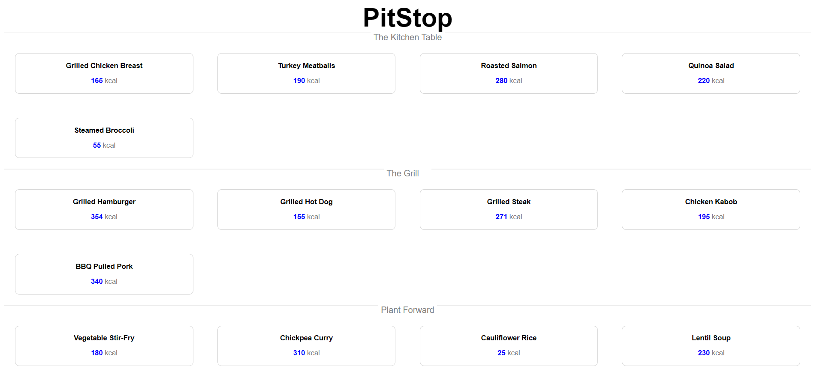
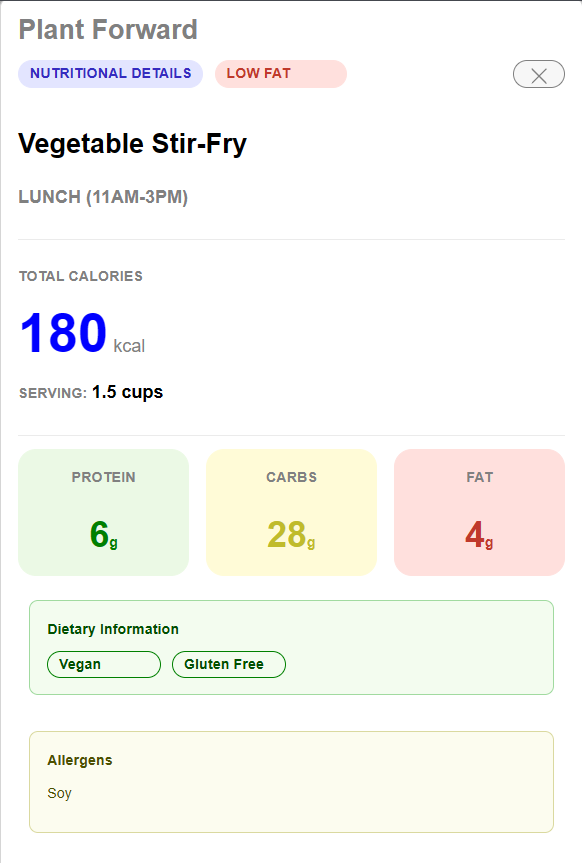

# PitStop
Welcome to PitStop! PitStop is a proof-of-concept dining app for UNC students, allowing them to see what items are currently available on the menu in an easy-to-use website.

PitStop is split into two sections, a list view and a food view. The list view (shown below) allows users to browse all of the options available in the UNC dining system, with interactive buttons for users to select which item they would like to look at in more detail.

From there, users can enter the food view by clicking on an item. Here, users can get a detailed look at the nutritional info of their item. Details include the station at which the item is served, nutritional details such as Low Fat or High Protein, the times the food is served (Breakfast, Lunch, Dinner), the name of the food, the calories per serving, the serving size, the grams of protein, carbs, and fat, any dietary descriptors (such as Halal, Gluten-Free, etc.), and any allergens. For the dietary information and allergens cards, they are hidden if no dietary information or allergens are provided.

# Implementation
The list and food views are switched between via the food items in the list view and the exit button in the food view. From here, two mains: one for list view and one for food view are hidden or shown depending on the view the user is in, preventing an entire new page having to load.

As for storing the data, due to this being a proof of concept with a relatively small dataset, all food items are simply manually entered into the state array upon opening the website.

# Strech Goals
One of our stretch goals was to have version control using Github, which we successfully implemented, with both of us having successful commits and merges to the project.

Another one of our stretch goals was to have the switching between the food view and the list view without having to fully reload the page, which we successfully implemented by hiding and showing our two mains for each view and our switchToFoodView and switchToListView functions in our app.js file.

# Issues in Development
An issue we ran into in development was figuring out how to switch between the different views. At first, we attempted a simple .hidden class in the CSS, but the "display: none" attribute in .hidden wasn't powerful enough to override the other display attributes in the Id-level CSS, so we made specific class-Id tags in CSS for the food-view and list-view (as well as the dietary info and allergens, which are hidden if no info is provided).

# Future Work
In the future, we will work to connect to some sort of API or webscraper to update the page in real-time with the items that are currently available, rather than listing them all at once. Additionally, we want to make some sort of translucent layer seperating the food view from the list view, so that when you enter the food view it doesn't look like an entirely different page as it does now. Additionally, we would likely have to implement some form of localStorage to cleanly implement the webscraper/API to store our food options.